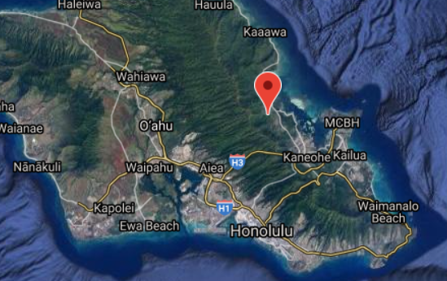
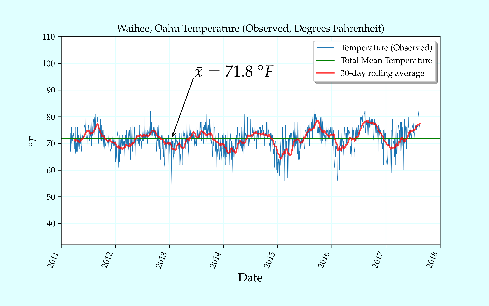
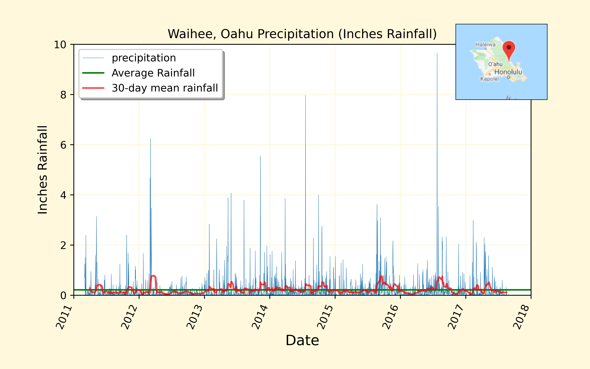
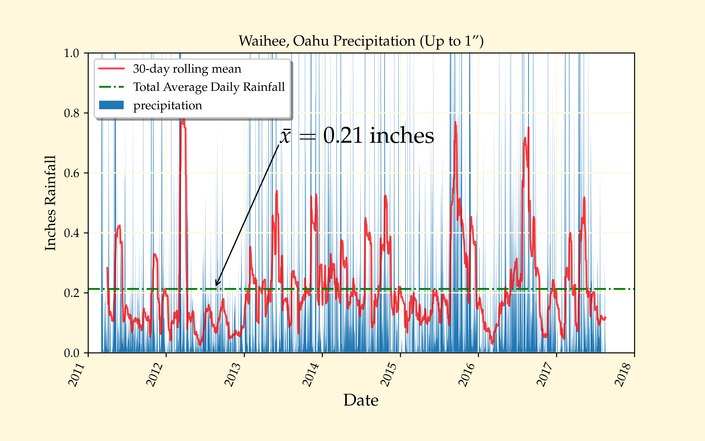
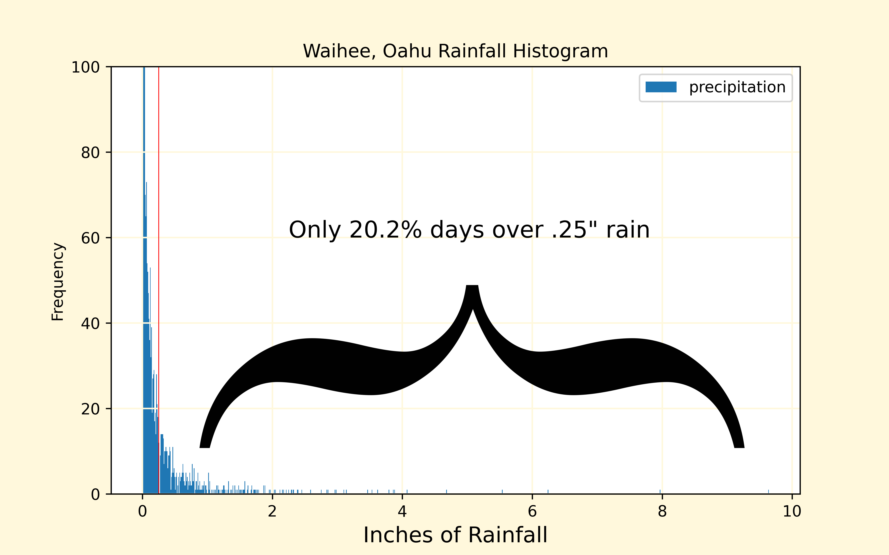
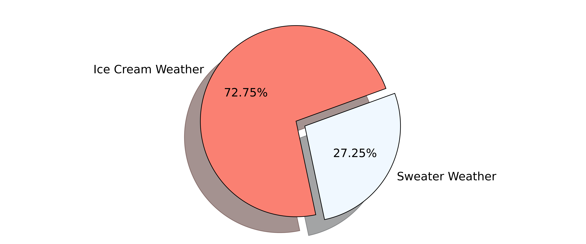

# *Surf's Up!*
## Investing in Surf Boards and Ice Cream: O'ahu meteorological analysis
 
### Overview:

The purpose of this analysis is to bring insight to investors to a potential combination surf board/ice cream shop on O'ahu. In order for investors to have confidence in the business, they will need to explore what the weather is like on the island. This is due to the fact that surfing and ice cream are highly dependent on meteorological phenomena such as temperature and rain. Investors are specifically looking for data on June and December weather on O'ahu to determine the likelyhood of success.
Situated 108 feet above sea level, the weather station "Waihee 837.5", the most active on the O'ahu network, will be used for the meteorological analysis.  This low-lying station overlooking the shores NNE (north-north-east) of Honolulu will be very representative of typical beach weather on O'ahu.
 
|   |
| :---:   |
| </img> |
|  Location of Weather Station *Waihee 837.5* (USC00519281)   |

### Results:

###### June & December Temperature Statistical Data
|  Parameter | June   | December   |
| ---:       |  :---  |     :---   |
|count       |	1700. |   	1517.  |
|mean        |	74.94 | 71.041529  |
|std         |	3.257 |	3.745920   |
|min         |	64.   |   56.      |
|25%         |	73.   |  	69.      |
|50%         |	75.   |  	71.      |
|75%         |	77.   |  	74.      |
|max         |	85.   |  	83.      |

* The minimum temperature in December (56 deg. F) is 8 degrees Fahrenheit lower than in June (64 deg. F). 
* The maximum temperture in December (83 deg. F) is only three degrees Fahrenheit lower than in June (85 deg. F).
* The average temperature in June (~75 deg. F) is roughly 4 degrees Fahrenheit warmer than in December (~71 deg. F)

### Summary:

As these temperatures are very mild across both June and December, there is a high likelyhood of year-round success.

|   |
| :---:   |
|  </img>  |
|  Figure 1.  O'ahu Temperature Observations (Station *Waihee 837.5* USC00519281)   |

#### Another key weather indicator which may be analyzed from these measurement data is precipitation.

|   |
| :---:   |
|  </img>  |
|  Figure 2.  O'ahu Precipitation Observations (Station *Waihee 837.5* USC00519281)   |

####   Although temperatures will stay mild, significant rain could hinder sales.

|   |
| :---:   |
|</img>|
|  Figure 3.  Detail: O'ahu Precipitation (Up to 1")   |

#### Fortunately, average daily rainfall for Oahu is just over two-tenths of an inch. 

|   |
| :---:   |
|</img>|
|  Figure 4.  O'ahu Precipitation Histogram  |

#### While there are occassional storm systems, we expect only one out of every five days will see rain over one quarter-inch.

### But is it Ice Cream Weather?

#### For the purpose of this hypothetical query, we will define Ice Cream Weather as Rainfall < .25" and Temperature > 66℉.  We discovered that of 2356 days, 1714 of them were worthy of Ice Cream Weather status. That is nearly three out of four days, and lends to an ice cream season especially lengthy for any part of the world.  

|   |
| :---:   |
|</img>|
|  Figure 5.  Days Rainfall < .25" and Temperature > 66℉  |

In light of the O'ahu station weather analysis, we anticipate success in both the surf board and ice cream components of the store.  With the right outlook on weather forcasting, the store can maintain good profitability by offering ice cream more frequently during the warmer half of the year (June-December), and holding back during periods of forecast heavy precipitation.  Also maintain an eye for forecast surfing weather, that is high sea-level wind speeds and vorticity, in order to time promotions and discounts to your best advantage.
